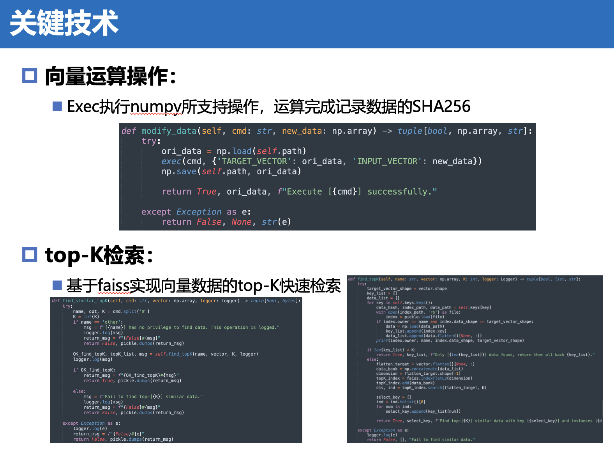

# AZU

基于Python的分布式向量数据库


### 环境配置

```python
numpy
faiss-cpu
```

### 项目介绍





### 运行方式

配置完环境后（推荐使用conda进行环境配置），在当前目录下运行

```python
python master.py  # on Master
python slave.py  # on every Slave
python client.py  # on Client
```

